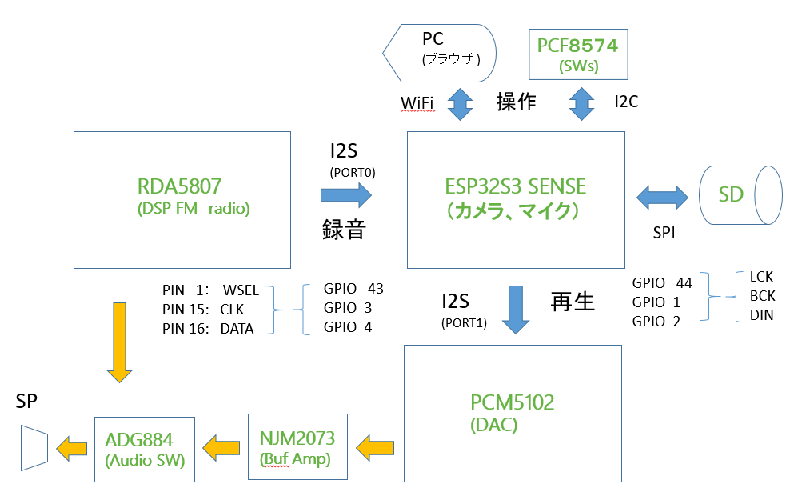
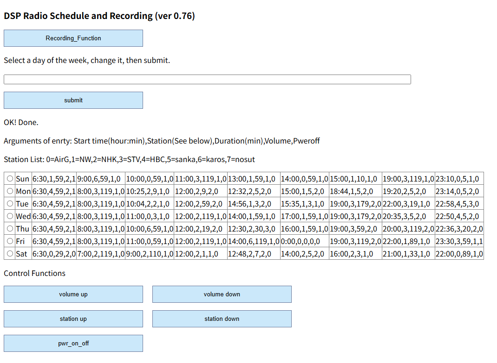
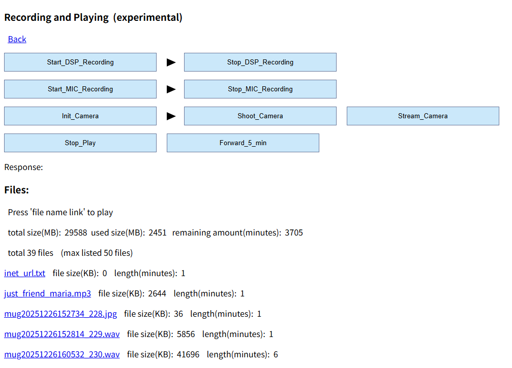
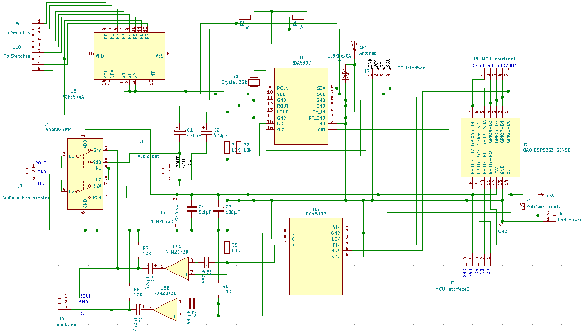

<H3>Trying out all the features of the XIAO ESP32S3 SENSE</H3>

<a href="https://www.switch-science.com/products/8969">Seeed Studio XIAO ESP32S3 SENSE</a>の機能を全て利用するプログラムである。 
XIAO ESP32S3 SENSE は、XIAO ESP32S3に、以下の機能が追加されている。 
・カメラ 
・マイク 
・SDドライブ 
また、I2C、I2S、SPIなどの外部インターフェースがある。 
これらを同時に利用する場合に、どのような課題があり、それらが解決可能であるか実証してみた。 
まず、実現した機能を列挙する。 
・表示機能（SH1106） 
・DSPラジオ（<a href="https://www.aitendo.com/product/4797">RDA5807FP</a>）の制御 
・DSPラジオの出力をSDカードに録音（WAVファイル）、再生 
・カメラの画像をSDカードに記録（jpgファイル）、表示（ブラウザ） 
・カメラの画像をストリーミング表示（ブラウザ） 
・マイクの音声をSDカードに録音（WAVファイル）、再生 
・インターネットラジオに接続・再生 
紆余曲折はあったが、上記の機能をほぼ同時に実現するための構成を以下に示す。

 

WAVファイルを再生するDACには、PCM5102のモジュールを利用している。 
DSPラジオと音声レベルを合わせるためPCM5102の出力は、NJM2073のバッファアンプを経由する必要がある。 
また、DSPラジオとPCM5102の出力を切替えるため、アナログスイッチのADG884を利用している。 
操作は、ブラウザ（WiFi）とボタンスイッチで行うが、ボタンスイッチについては、接続するGPIOが不足するため、 
IOエクスパンダとしてPCF8574（I2C接続）を利用する。 
なお、開発はArduino IDE 2.1で行った。最新版では状況が異なるかもしれない。 
又、この成果は経験にもとづくもので、「実験的（experimental）」である（動作を保証するものではない）。 

<strong>GPIOの不足</strong>

カメラ機能、マイク機能はカメラモジュールとの間で内部接続されているが、SDドライブは、SPIとしてGPIOの7,8,9を利用する。 
I2Cとしては、GPIOの5,6を利用する。 
I2Sの入力用（RDA5807FP）として、GPIOの1,2,43、さらに出力用（PCM5102）として、GPIOの3,4,44を利用する。 
これでGPIOの空きがなくなり、操作用のスイッチ類を接続するために、IOエクスパンダとしてPCF8574が必要になる。 

<strong>I2Sのライブラリ</strong>

後に述べるが、細かい操作が必要になるので、"I2S.h"は不可で、"driver/i2s.h"を利用した。 
APIの仕様は、<a href="https://docs.espressif.com/projects/esp-idf/en/v4.2/esp32/api-reference/peripherals/i2s.html" target="_blank">”SP-IDF Programming Guide”（V4.2）</a>の記述を参考にした。 

<strong>I2Sの割り当て</strong>

XIAO ESP32S3 SENSEには、2つのI2Sポートがあり、機能は同じであると想定し、入力側にPORT1を利用することにしていたが、デバッグ中に、マイクが利用する 
PDM MODE（Pulse Density Modulation）が、PORT0に限られていることがエラーメッセージで判明した。 
従前よりRDA5807FPからの入力にPORT1、PCM5102への出力にPORT0を割り当てており、これらの変更が必要になった。 
PCM5102への出力に利用している<a href="https://github.com/schreibfaul1/ESP32-audioI2S  ">ライブラリ（audioI2S）</a>は既定ではPORT0を利用するが、APIでPORT1に変更した。 
I2SのPORT0は、マイクとRDA5807FPで切り替えて利用するので、都度、install、uninstallしている。 
又、I2Sが動作していると、音声出力にノイズが入るので、利用しないI2Sはstart/stopを行う必要がある。 
他に、I2Sが動作しているとカメラの画像が取り込めないという現象（DMAの競合か？）が発生したため、利用しないI2Sは、都度、uninstallしている。 

<strong>SDカードの書き込みエラー</strong>

SDHCタイプ（32GBまで）のSDカードにおいて、連続書き込みを行うと数分で書き込みエラーとなる現象が発生した。 
当初、100KB超のバッファを用意して、可変サイズの書き込みを行っていたが、ほぼ100%の確率でエラーが発生した。SDタイプ（2GB）のカードではこのエラーは発生しない。 
書き込みサイズを32KB固定にしたところ、エラーの発生率が格段に低下した。現状、30分程度の書き込み（既定時間にしている）は、ほぼ正常終了する。 

<strong>消費電流の問題</strong>

XIAO ESP32S3 SENSEには、カメラをWiFiのストリームで利用すると発熱するという問題があって、対策として、アルミのヒートシンク（貧弱）が付属している。 
DSPラジオのみの場合は、110mA程度（USB電流計）であるが、カメラを起動すると、220mA程度になり、WiFiでストリームを利用すると350mA程度（発熱する）になる。 
したがって、この状態での常時利用は止めた方が無難である（冷却ファンなどの対策が必要）。 

<strong>グローバル変数領域とDMAバッファ領域の競合</strong>

グローバル変数領域の利用量を増やすとDMAバッファ領域の確保が不可となり、I2Sが初期化できない現象が発生する。 
グローバル変数領域とDMAバッファ領域は融通しあっているようで（コンパイル時のメッセージでは空きがあるように見える）、 
現状は、両者がギリギリでOKの状態になっている。 

<strong>機能</strong> 

 
操作はWiFi接続のブラウザから行う。ブラウザから、"http://192.168.x.y"（x.yは起動時、OLEDに表示） 　にアクセスすると以下の画面が表示される。 
 
DSPラジオは、この画面で操作する。週間スケジュールの設定方法は、<a href="https://github.com/asmnoak/RDA5807_radio_ESP32C3_with_weekly_Schedule">週間スケジュールを設定できるFM DSPラジオ</a>を参照のこと。 
XIAO ESP32S3 SENSEの機能は、"Recording_Function"ボタンを押した時に表示される次の画面で利用できる。 
 

 ・FM DSPラジオをSDカード（WAVファイル）に録音、再生する機能については<a href="https://github.com/asmnoak/DSP_Radio_RDA5807_with_recording_to_SD_of_XIAO_ESP32S3_SENSE">こちら</a>を参照。 
 ・再生については、5分間の先送り機能を追加した。 
 ・マイクの録音、再生についても、ほぼ同様である。ただし、マイクの感度が低く（バックノイズ的な音は拾ってくれない）、録音の音声レベルが不足気味である。 
 ・カメラ機能を利用する場合は、最初にカメラを初期化（"Init_Camera"）する。次に、jpgファイルとして保存するか、ストリーム再生するかを選択する。 
&nbsp;&nbsp;カメラ機能を停止する場合は、一旦Power OFFする必要がある。 
 ・jpgファイルは、ファイル名をクリックすると表示される。 
 

<strong>H/W構成</strong> 
 ・Seeed Studio XIAO ESP32S3 SENSE - コントローラ、SDドライブ、カメラ、マイク 
 ・I2C接続&nbsp; RDA5807FP 
 ・I2S接続&nbsp; PCM5102モジュール　(UDA1334でも可) 
 ・I2C接続&nbsp; SH1106 64x32 OLED表示装置（SD1306を利用する場合はライブラリ変更が必要） 
 ・出力切替え&nbsp; ADG884 アナログスイッチ 
 ・バッファアンプ&nbsp;：NJM2703 
 ・I2C接続&nbsp; IOエクスパンダ：PCF8574 
 ・Xtal発振器（32768Hz）、コンデンサ、抵抗類、オーディオジャック、配線類 

<strong>回路図</strong>（PDFファイルあり） 

 

　・J4　USB power のポリヒューズは、500mA程度。入手できない場合はジャンパー接続（自己責任）。 
　・アンテナ回路のTVSダイオードはオプション（FM周波数なので、寄生容量の小さいもの）。 
　・プログラムコード上に定義したPCF8574の操作スイッチの接続は、以下の通り。 
<ul type="circle">
<li>音量：P0,P1</li>
<li>選局：P2,P3（録音中は、停止）</li>
<li>録音：P4</li>
<li>撮影（シャッター）：P5</li>
</ul>

<strong>接続</strong> 
各コンポーネントの接続は回路図を参照のこと。 

<strong>インストール</strong> 
<ol>
<li>コードを、ZIP形式でダウンロード、適当なフォルダに展開する。</li>
<li>ArduinoIDEにおいて、ライブラリマネージャから以下を検索してインストールする</li>
 <ul>
  <li>Adafruit_BusIO</li>
  <li>Adafruit_GFX</li>
  <li>Adafruit_SH110X</li>
  <li>Adafruit_PCF8574</li>
  <li>RDA5807</li>
</li>
 </ul>
<li>追加のライブラリを、ZIP形式でダウンロード、ライブラリマネージャからインストールする</li>
 <ul>
  <li>TimeLib&nbsp;:&nbsp; https://github.com/PaulStoffregen/Time</li>
  <li>Audio-audioI2S（<strong>注 V3.0.x</strong>）</li>
  <li>camera_index</li>
  <li>camera_pins</li>
 </ul>
<li>ArduinoIDEからxiao_esp32_sense_rda5807_pcm5102_SD_SH116_PHOTO_master.inoを開く</li>
<li>「検証・コンパイル」に成功したら、一旦、「名前を付けて保存」を行う</li>
<li>利用するWiFiのアクセスポイントに合わせて、スケッチのssid、passwordを編集する。</li>
<li>ローカルのラジオ局の周波数"stnFreq"と局名"stnName"を設定する。</li>
</ol>

<strong>注意事項</strong> 
・SDカードは、「SD」、「SDHC」（32GBまで）タイプに対応。ファイルサイズは2GBまで。クラスタサイズ32KBでフォーマットする。 
・SDカードへの書き込みでエラーが発生することがあり、再フォーマットが必要になるケースがあります。SDカードは専用とし、 
　 <strong>保存が必要なデータは決して置かないでください</strong>。 
・30分（既定時間）の録音で、ファイルサイズが220MB程度になります。ファイルサイズとSDカードの容量に注意。容量超過でエラーになると 
　 再フォーマットが必要になることがあります。 
・ArduinoIDEのシリアルモニターにトレース情報を出力しています。 
・一通りの動作は確認していますが、まだ、bugはあると思います。 
・動作を保証するものではありませんので、利用の際は、自己責任でお楽しみください。 

